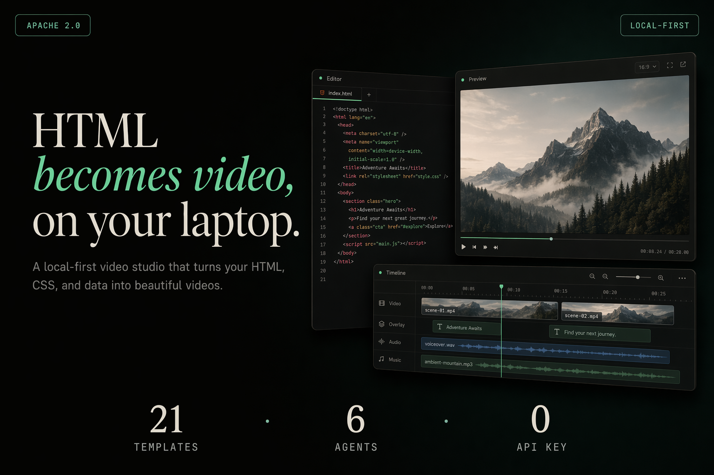

# html-video

<p align="center">
  
</p>

> **HTML becomes video — on your laptop.** Bring your local coding agent (Open Design · Trae CLI · Claude Code · Cursor · Codex · Gemini · Grok · Qwen · OpenCode · Copilot · Aider · Hermes · Qoder · or the Anthropic API). Describe a video, or **paste an article link / GitHub repo**, and the agent turns it into a multi-frame, fully animated video — then renders it to a real MP4 right on your machine. Add **free voice narration** and **word-by-word captions**, then **publish straight to YouTube Shorts and Facebook Reels**. Two pluggable rendering engines, a curated template gallery, no per-render fees, no vendor lock-in. Apache-2.0.

<p align="center">
  <a href="LICENSE"></a>
  <a href="#supported-agents"></a>
  <a href="#template-gallery"></a>
  <a href="#rendering-engines"></a>
  <a href="#narration--captions"></a>
  <a href="#publish"></a>
</p>

---

## What it does

One sentence (or one link) goes in; a finished, narrated, captioned MP4 comes out — and, if you want, gets posted to social with an AI-written title and description. Everything runs locally except the optional source fetch, narration, and the publish step.

- **Prompt / link / repo → video.** Describe a topic, or paste a web article or a GitHub repo. The studio fetches the source **server-side** (handles WeChat 公众号 articles) and the agent builds a multi-scene video from the *real* content.
- **Real MP4, rendered locally.** Two shipped engines — **Hyperframes** (headless Chromium + ffmpeg, the default) and **Remotion** (React/TSX, per-frame motion enhancement). No cloud render, no per-clip fee.
- **Free narration + captions.** Voiceover via **Edge-TTS** (Microsoft, no API key, Vietnamese voices by default) and **word-by-word burned captions**, mixed into the MP4 at export.
- **Publish in one click.** Upload to **YouTube Shorts** and **Facebook Reels** (multi-account OAuth), with AI-generated viral titles/descriptions — or quick-upload any MP4 without a project.
- **Studio + CLI.** A local browser studio (bilingual Vietnamese / English) *and* a scriptable `html-video` CLI.

---

## How it works

The pipeline is the same whether you start from a prompt, an article, or a repo:

```
  prompt / link / repo
        │
        ▼
  ① source fetch        studio pulls the URL or repo server-side, flattens it to Markdown
        │
        ▼
  ② agent loop          your agent reads the material + the picked template's style and emits
        │               a content-graph (the storyboard) + one HTML block per frame
        ▼
  ③ content-graph       multi-frame IR — nodes (entity / data / text) + edges (sequence /
        │               dependency / contrast); topo-sorted into frame order & timing
        ▼
  ④ per-frame HTML      each node becomes a self-contained animated HTML frame on disk
        │
        ▼
  ⑤ render per frame    Hyperframes records each frame in headless Chromium → mp4;
        │               data frames can be "enhanced" to native Remotion animations
        ▼
  ⑥ ffmpeg concat       single engine → concat demuxer (-c copy); mixed engines → concat
        │               filter + re-encode (rebuilds a clean timeline)
        ▼
  ⑦ soundtrack          optional Edge-TTS narration + music mixed in, word-by-word captions
        │               burned via ffmpeg's ass filter
        ▼
      your.mp4  ──►  optional: YouTube Shorts / Facebook Reels
```

Steps ②–④ are the "meta-layer": the agent decides the storyboard, the engine decides how to draw it, and neither leaks into the other. Single-frame videos take a fast path that skips the content-graph — one template, one HTML, straight to render.

---

## Quick start

### Prerequisites

| Requirement | Minimum | Check |
|---|---|---|
| **Node.js** | 20+ | `node --version` |
| **pnpm** | 9+ | `pnpm --version` |
| **ffmpeg** | recent (a **libass**-enabled build for burned captions) | `ffmpeg -version` |
| **Chromium** (or Playwright browsers) | — | `npx playwright install chromium` |
| **edge-tts** *(optional, for narration)* | — | `pipx install edge-tts` |

The default engine records animated HTML in headless Chromium, then ffmpeg (libx264) encodes MP4. Install Playwright's Chromium if you don't have a system Chrome. Burned word-by-word captions need an ffmpeg built with `libass` — the `Makefile` will prefer a bundled ffmpeg at `.html-video/bin/ffmpeg` if present, otherwise it falls back to system ffmpeg.

### Install & run

```bash
pnpm install
pnpm -r build

# start the studio (http://127.0.0.1:3071)
make studio            # or: node packages/cli/dist/bin.js studio
make dev               # build everything, then start the studio
```

In the studio: pick a template (or just describe a video / paste a link), chat with your agent, edit per-frame text inline, add narration + captions, export MP4, then publish to YouTube / Facebook.

CLI utilities:

```bash
node packages/cli/dist/bin.js doctor                 # detect installed agents + engines + ffmpeg + edge-tts
node packages/cli/dist/bin.js search-templates --intent "github stars race" --top 3
node packages/cli/dist/bin.js project-narrate <id> --text-file script.txt   # attach Edge-TTS narration
```

---

## Rendering engines

The engine is an implementation detail behind a single adapter interface — one `render(input, ctx)` contract that any backend can satisfy. Two engines ship today:

| Engine | Paradigm | Role | Status |
|---|---|---|---|
| [Hyperframes](https://github.com/heygen-com/hyperframes) | HTML + CSS + GSAP | Default base engine — records each frame in headless Chromium, encodes with ffmpeg (libx264). | ✅ Shipped |
| [Remotion](https://www.remotion.dev/) | React / TSX | Per-frame motion enhancement — **bridge mode** wraps an existing HTML frame onto Remotion's timeline; **native mode** renders a `.tsx` data template directly. | ✅ Shipped |

A data frame rendered as a static Hyperframes chart can be upgraded ("enhanced") to a native Remotion animation (growing bars, rolling numbers) per-frame, non-destructively — the base HTML is kept for one-click revert. Remotion is source-available and free for individuals / small teams; the adapter reports `commercial-restricted` licensing so the agent can steer license-sensitive jobs to the free engine.

> Motion Canvas / Revideo / Manim adapters are not built — the adapter interface is designed for them, but only Hyperframes and Remotion are runnable today.

---

## Narration & captions

Give the finished video a voice — for free, no API key.

- **Narration** — type a script (per-frame or whole-video); **Edge-TTS** (Microsoft) synthesizes it. Vietnamese voices ship by default (`vi-VN-HoaiMyNeural` / `vi-VN-NamMinhNeural`), with English US/UK available. Adjustable volume (−20…+6 dB) and speed (0.5…1.5×). An AI-draft button writes a scroll-stopping short-form script from your content-graph.
- **Word-by-word captions** — generated from the narration's own timing and **burned in** via ffmpeg's `ass` filter (two-layer glow + box style), revealing one word at a time.
- **Fit to narration** — re-paces each frame's duration to match the length of its voiceover.
- **Music** — an optional background track is mixed under the voice (ducked, with fade in/out); the audio is padded so the last scene is never cut short.

Both narration and music are mixed into the exported MP4 at export time. No `edge-tts` installed? The rest of the studio works unchanged.

---

## Publish

Post the finished MP4 without leaving the studio:

- **YouTube Shorts** — OAuth connect (**multiple channels** supported), resumable upload, auto `#Shorts` tag.
- **Facebook Reels** — connect a Page, publish or draft a Reel via the Graph API.
- **AI titles & descriptions** — generate a viral title + description from the project's content-graph, or from a free-form topic.
- **Quick-upload** — attach any MP4 (no project needed) and upload it directly to either platform.

Exports are tracked per project, with "posted" badges and repost buttons in the **Exports** panel.

---

## Supported agents

Auto-detected on your `PATH`; switch the active one from the studio's top bar. The studio leads with **Open Design (Vela)** — one login, many models — then falls back to the first *available* agent so a fresh project always has a working backend.

| Agent | Detection | Invocation |
|---|---|---|
| **Open Design (Vela / AMR)** | `vela` / bundled in the Open Design app | ACP over stdio — one login, live model catalog |
| **Trae CLI** | `traecli` | `traecli acp serve --yolo`, ACP over stdio |
| **Claude Code** | `claude` | `claude --print`, prompt via stdin |
| **Cursor Agent** | `cursor-agent` | `cursor-agent --print` |
| **Codex CLI** | `codex` | `codex exec`, prompt via stdin |
| **Hermes** | `hermes` | `hermes chat`, prompt via argv |
| **Gemini CLI** | `gemini` | prompt via stdin |
| **Grok** | `grok` | `grok -p <prompt>` |
| **Qwen Code** | `qwen` | prompt via stdin |
| **OpenCode** | `opencode` | `opencode run`, prompt via stdin |
| **GitHub Copilot CLI** | `copilot` | `copilot --allow-all-tools`, prompt via stdin |
| **Aider** | `aider` | `aider --message <prompt>` |
| **Qoder CLI** | `qodercli` | prompt via stdin |
| **Anthropic API** | BYOK | direct Messages API — works with no CLI installed |

Nothing installed? Set an Anthropic key (or an OpenRouter-compatible `ANTHROPIC_BASE_URL`) and the studio talks to the Messages API directly.

---

## Template gallery

23 curated templates, each a self-contained, agent-readable unit described by a `template.html-video.yaml` manifest the studio scans at startup. A manifest carries everything the agent needs to pick and drive the template without opening the HTML: `category` / `tags` / `best_for`, supported resolutions & aspect ratios, an `inputs` JSON schema, and full **license provenance** (SPDX id + `attribution_required` / `redistribution_allowed` / `commercial_use` flags + a three-layer `provenance` block).

Every template is **license-clean by construction**: forks carry their original license, and [`templates/NOTICE.md`](templates/NOTICE.md) records each upstream source and its SPDX. Templates span data viz (NYT-style charts, Swiss / Vignelli grids, growing-bar rollups), titles & VFX (glitch, kinetic type, typewriter cursor), heroes & cinematics (liquid gradients, light-leak, warm grain), product promos (15s / 30s multi-scene), and explainer scaffolds (decision trees). The format is open, so community templates drop in the same way.

---

## Architecture

```
packages/
├── content-graph/         Multi-frame storyboard IR (nodes + edges, validate, topo-sort)
├── core/                  Project / Asset / ContentGraph types, registries, orchestrator,
│                          Edge-TTS narration, word-by-word captions, ffmpeg concat + audio mux
├── adapter-hyperframes/   Default engine — real render via headless Chromium (Playwright) + ffmpeg
├── adapter-remotion/      Remotion engine — bridge (HTML→timeline) + native (.tsx data) modes
├── runtime/               Agent runtime — detect / spawn / stream 14 coding-agent backends
├── cli/                   `html-video` command + the studio HTTP server + source fetching +
│                          YouTube / Facebook publishing
├── project-studio/        Browser studio UI (static SPA) — chat, gallery, frames, narration, publish
└── studio-next/           React/Vite spike (not wired to the backend — see its SPIKE-REPORT.md)
templates/                 23 curated, license-clean video templates
```

See [ARCHITECTURE.md](ARCHITECTURE.md) for a function-level tour of every package.

---

## License & lineage

[Apache-2.0](LICENSE). This project is a fork of [nexu-io/html-video](https://github.com/nexu-io/html-video) — the pluggable-engine HTML→video meta-layer — extended with free Edge-TTS narration, word-by-word captions, and YouTube / Facebook publishing. It builds on the [Hyperframes](https://github.com/heygen-com/hyperframes) (Apache-2.0) and [Remotion](https://www.remotion.dev/) rendering engines; several bundled templates derive from open-source design skills recorded in [`templates/NOTICE.md`](templates/NOTICE.md) and each template's `provenance` block. Studio / designer names referenced in template provenance are recorded as stylistic inspiration only — this project is not affiliated with, endorsed by, or sponsored by any of them.
